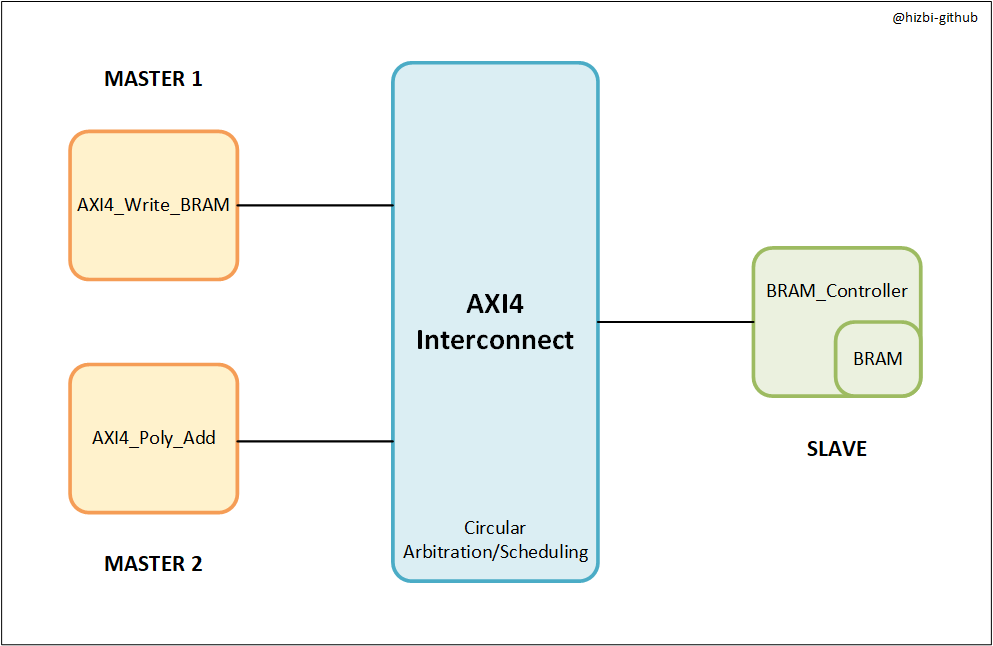
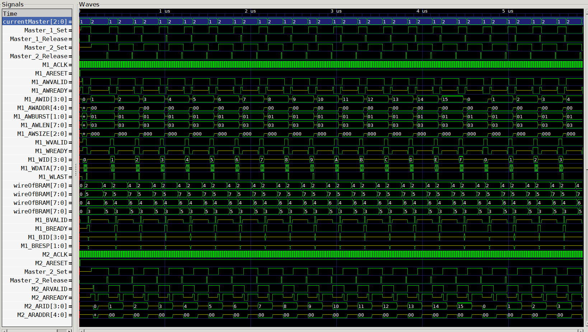
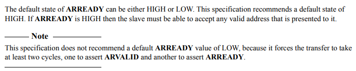
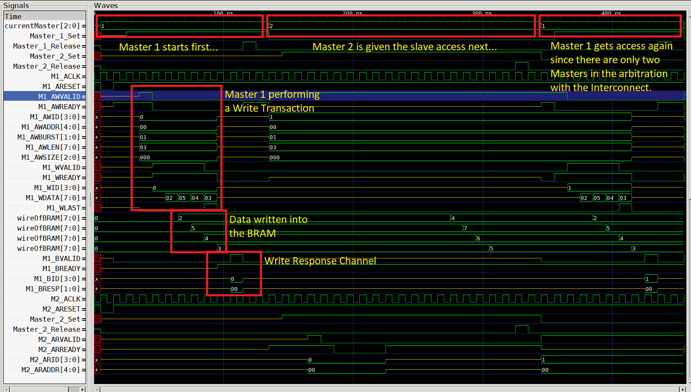
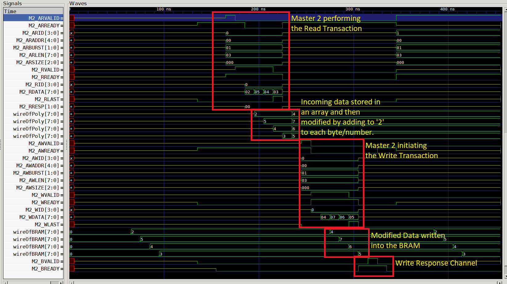
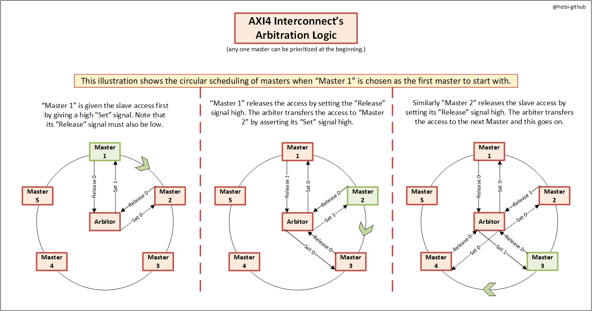
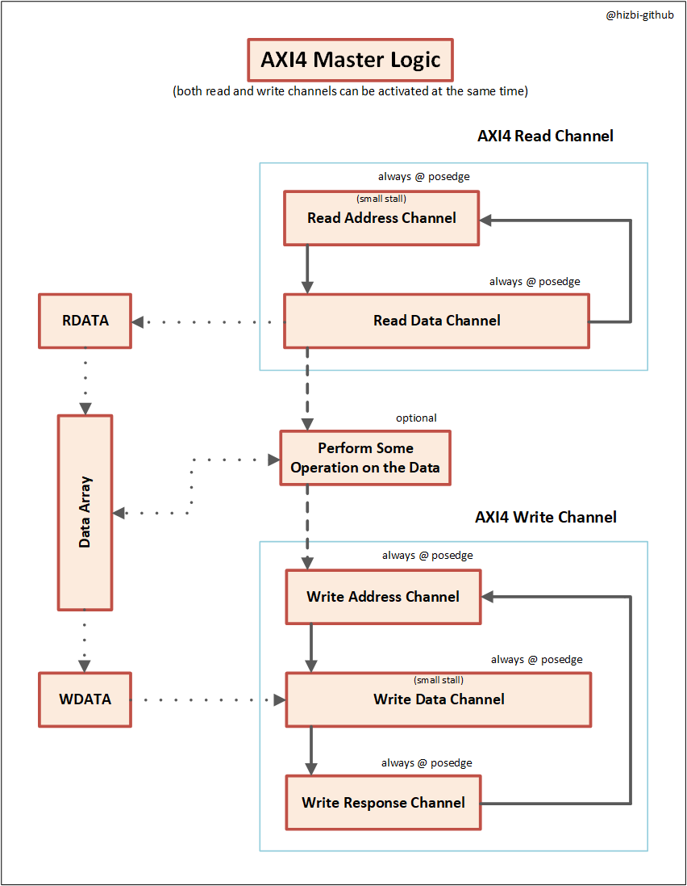
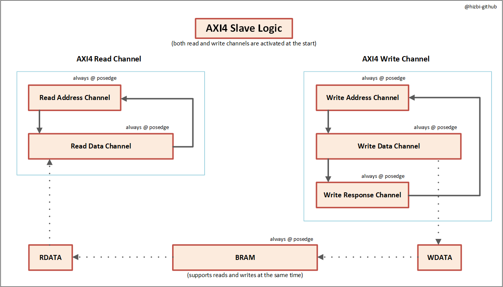
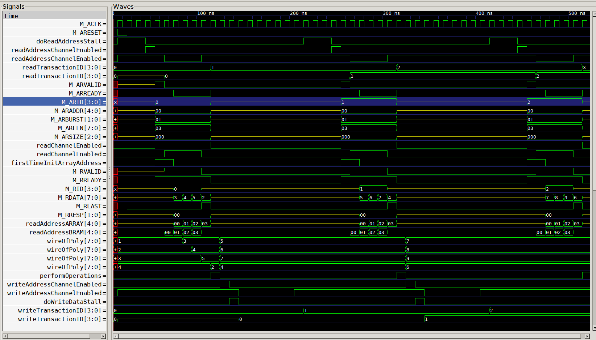
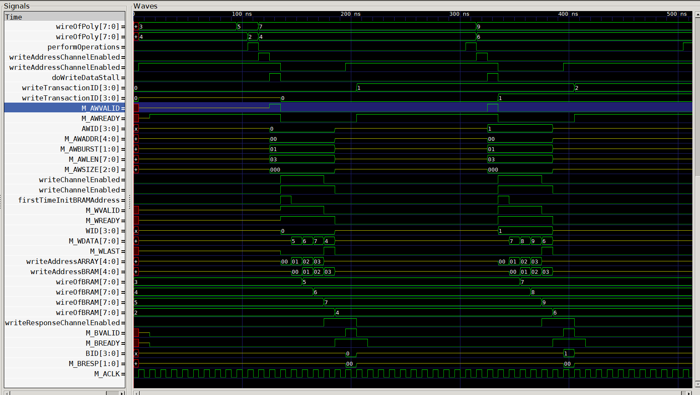

# AXI4_Master_Interconnect_Slave

  

# Introduction

  

  Interconnect granting 20 turns to the two Masters each to access the BRAM Slave one by one

This project is based on AMBA AXI4 specifications as provided by ARM. It implements a master, a slave and interconnect module which communicatue by using the AXI4 protocol. An AXI4 slave interface and the appropriate code is provided. Similarly a master module is also implement according to the AXI4 specs which can perform read/write transactions with the slave using the AXI4 interconnect.

The interconnect can be used to either connect a single master and slave modules together or multiple masters and a single slave module. In the latter configuration, the interconnect uses simple circular arbitration/scheduling to enable multiple masters to perform successful transcations with the slave one by one.

Here are some features of this implementaion:

    1. Master can initiate and perform read and write transactions at the same time.
    2. The data transation doesn't proceed unless the handshake is successful in the address channel(s).
    3. In both read and write channels, the requested data is available with a maximum delay of 2 clock cycles after the ARVALID/AWVALID signal has been asserted by the master.
    4. Each channel has its own IDs to keep track of both address and data transactions.
    5. Data can be resumed without losing it if the receiving side suddenly drops their RREADY/WREADY signals.
    6. All the burst modes such as FIXED, INCREMENT, and WRAP addressing modes are supported.
    7. The design also contains an active low global reset signal as per specs.
    8. The interconnect provides a simple scheduling to deal with multiple masters interfacing with a single slave and the algorithm can be easily scaled in case of more masters.
    9. As suggessted by the AXI4 specification, the VALID signal in any of the channels doesn't wait for the respective READY signal to be asserted HIGH. READY signals are asserted HIGH by defautlt to prevent wasting any clock cycles.

  

Link to the original AXI4 specifications document:

    https://developer.arm.com/documentation/ihi0022/e/AMBA-AXI3-and-AXI4-Protocol-Specification

# Example of using this AXI4 Interface

Here is the result of two AXI4 Masters and one AXI4 Slave with BRAM connected via an AXI4 Intercconect. The first master "AXI4_Write_BRAM" performs a write transaction of INCREMENT type with data "2, 5, 4, 3" into the slave "AXI4_BRAM_Controller". After successful transaction, the first master signals the interconnect to release the access to the slave. The interconnect then grants the slave access to the second master "AXI4_Poly_Add". This second master performs a read transaction to get the data written by the first master and then performs some mathematical operation on each byte of the data (in this case, '2' is added to each byte). Then, the second master does a write transaction to transfer the modified data back to the slave so it can be stored in the BRAM.

  

  

# Tools Used

    1. Icarus Verilog Compiler (iverilog) v12.0
    2. GTKWave Anaylyzer v3.3.100
    3. Microsoft VS Code Editor (with extensions adding support for Verilog)

GTKWave config files for different setup of simulation signals are provided in the "GTK_Wave_Configs" directory. Kindly load the appropriate config file when simulating the design to allow for better understanding.

# Interconnect Block Diagram

  

# Master Block Diagram

  

# Slave Block Diagram

  

# Data Resumibility 

  

# Verbose Simulation Waveforms (Single Master and Single BRAM Slave via Interconnect)

  

  

  = = = = = = = = = = = = = = = = = = = = = = = = = = = = = = = = = = = = = = =

